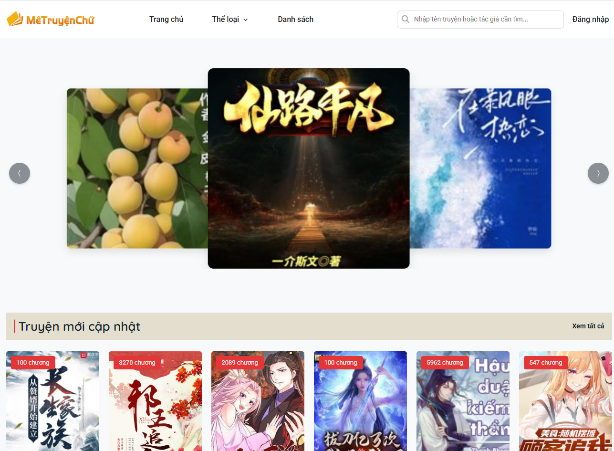
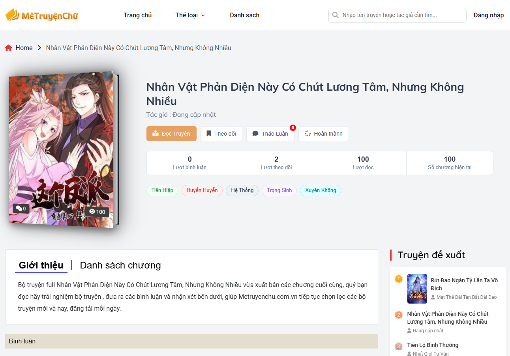

# **Hệ Thống Quản Lý Tiểu Thuyết: Chuyển Đổi sang PostgreSQL**

Dự án này là một hệ thống quản lý tiểu thuyết, cho phép bạn tự động lấy dữ liệu tiểu thuyết và chương từ một API bên ngoài và nhập chúng vào cơ sở dữ liệu cục bộ của bạn. Phần này sẽ hướng dẫn bạn cách thiết lập và cấu hình dự án để sử dụng PostgreSQL làm cơ sở dữ liệu.

## Giao Diện Ứng Dụng

Giao diện hiển thị danh sách tiểu thuyết được lấy từ API và lưu vào cơ sở dữ liệu.

## **Tính Năng Chính (Cập Nhật)**

* **Tích hợp PostgreSQL:** Dễ dàng kết nối với cơ sở dữ liệu PostgreSQL.  
* **Lấy dữ liệu tự động:** Tự động tải thông tin tiểu thuyết và chương từ một API được cấu hình sẵn.  
* **Nhập dữ liệu vào DB:** Nhập dữ liệu đã lấy vào cơ sở dữ liệu cục bộ của bạn một cách có tổ chức.  
* **Hệ thống Django:** Được xây dựng trên framework Django, đảm bảo tính bảo mật và khả năng mở rộng.

## **Hướng Dẫn Cài Đặt và Sử Dụng (Cập Nhật)**

Để bắt đầu với dự án này sử dụng PostgreSQL, hãy làm theo các bước dưới đây.

### **1\. Thiết Lập Cơ Sở Dữ Liệu với PostgreSQL**

Trước tiên, bạn cần chuẩn bị cơ sở dữ liệu PostgreSQL.

1. **Cài đặt PostgreSQL:**  
   * **Trên Windows:** Tải xuống trình cài đặt từ [trang web chính thức của PostgreSQL](https://www.postgresql.org/download/windows/).  
   * **Trên macOS:** Sử dụng Homebrew: brew install postgresql  
   * **Trên Linux (Ubuntu/Debian):** sudo apt update && sudo apt install postgresql postgresql-contrib  
2. **Khởi động Dịch vụ PostgreSQL:** Đảm bảo dịch vụ PostgreSQL đang chạy. Trên hầu hết các hệ điều hành, nó sẽ tự động khởi động sau khi cài đặt.  
3. **Tạo Cơ Sở Dữ Liệu và Người Dùng:**  
   * Mở terminal hoặc command prompt.  
   * Truy cập vào shell PostgreSQL với người dùng mặc định (thường là postgres):  
     psql \-U postgres

   * Tạo một cơ sở dữ liệu mới (ví dụ: novel\_db):  
     CREATE DATABASE novel\_db;

   * Tạo một người dùng mới (ví dụ: noveluser) và đặt mật khẩu:  
     CREATE USER noveluser WITH PASSWORD 'your\_password';

     *Thay thế your\_password bằng mật khẩu mạnh mà bạn muốn sử dụng.*  
   * Cấp quyền cho người dùng mới trên cơ sở dữ liệu:  
     GRANT ALL PRIVILEGES ON DATABASE novel\_db TO noveluser;

   * Thoát khỏi shell PostgreSQL:  
     \\q

4. **Cấu hình Cài đặt Django:**  
   * Mở tệp settings.py trong thư mục gốc của dự án Django của bạn.  
   * Cập nhật phần DATABASES để kết nối với cơ sở dữ liệu PostgreSQL:

DATABASES \= {  
    'default': {  
        'ENGINE': 'django.db.backends.postgresql', \# Thay đổi từ mysql sang postgresql  
        'NAME': 'novel\_db', \# Tên cơ sở dữ liệu bạn đã tạo  
        'USER': 'noveluser', \# Người dùng bạn đã tạo  
        'PASSWORD': 'your\_password', \# Mật khẩu của người dùng  
        'HOST': 'localhost', \# Hoặc địa chỉ IP của máy chủ PostgreSQL nếu khác  
        'PORT': '5432', \# Cổng mặc định của PostgreSQL  
    }  
}  
*Lưu ý: Thay thế novel\_db, noveluser, your\_password và localhost (nếu cần) bằng thông tin cấu hình của bạn.*

### **2\. Thiết Lập Môi Trường Dự Án & Khởi Tạo Cơ Sở Dữ Liệu (Cập Nhật)**

Các bước này sẽ tạo môi trường ảo Python, cài đặt các thư viện cần thiết và khởi tạo cấu trúc bảng trong cơ sở dữ liệu.

1. **Tạo Môi Trường Ảo:**  
   python \-m venv venv

2. **Kích Hoạt Môi Trường Ảo:**  
   * **Trên Windows:**  
     venv\\Scripts\\activate

   * **Trên macOS/Linux:**  
     source venv/bin/activate

3. Cài Đặt Các Phụ Thuộc (Cập Nhật):    
   pip install \-r requirements.txt

4. **Áp Dụng Các Migration Cơ Sở Dữ Liệu:** Bước này sẽ tạo các bảng cần thiết trong cơ sở dữ liệu novel\_db của bạn.  
   py manage.py makemigrations  
   py manage.py migrate

### **3\. Thao Tác Dữ Liệu: Lấy và Nhập**

Các bước này không thay đổi vì chúng liên quan đến logic ứng dụng để lấy và nhập dữ liệu, không phụ thuộc vào loại cơ sở dữ liệu.

1. **Lấy và Nhập Tiểu Thuyết:**  
   * Di chuyển vào thư mục API:  
     cd API

   * Chạy script để **lấy dữ liệu tiểu thuyết**:  
     py getnovels.py

   * Quay lại thư mục dự án chính và vào thư mục ứng dụng novel:  
     cd ..  
     cd novel

   * Chạy script để **nhập dữ liệu tiểu thuyết** vào cơ sở dữ liệu của bạn:  
     py importnovel.py

2. **Lấy và Nhập Chương:**  
   * Di chuyển trở lại thư mục API:  
     cd ..  
     cd API

   * Chạy script để **lấy dữ liệu chương**:  
     py getchapters.py

   * Quay lại thư mục dự án chính và vào thư mục ứng dụng novel:  
     cd ..  
     cd novel

   * Chạy script để **nhập dữ liệu chương** vào cơ sở dữ liệu của bạn:  
     py importchapters.py

### **4\. Chạy Ứng Dụng Django**

Cuối cùng, sau khi thiết lập cơ sở dữ liệu và nhập dữ liệu, bạn có thể khởi chạy ứng dụng Django của mình:

py manage.py runserver  

### 5. Deploy bằng Railway

Railway là một nền tảng đơn giản giúp bạn dễ dàng deploy ứng dụng Django online cùng với cơ sở dữ liệu PostgreSQL miễn phí.

---

#### 📝 Các bước thực hiện:

---

#### 1. Đăng ký tài khoản Railway

- Truy cập [https://railway.app](https://railway.app) và đăng ký tài khoản (có thể đăng nhập bằng GitHub).
- Railway cho phép bạn sử dụng gói PostgreSQL miễn phí từ **Aviencloud** hoặc **Railway-hosted**.

---

#### 2. Tạo project mới và provision PostgreSQL

- Nhấn **New Project** → chọn **Provision PostgreSQL**.
- Sau khi tạo xong, vào tab **Database** → **Connect** để lấy các thông tin kết nối:
  - `Host`
  - `Database`
  - `User`
  - `Password`
  - `Port`

---

#### 3. Cấu hình kết nối PostgreSQL trong `settings.py`
